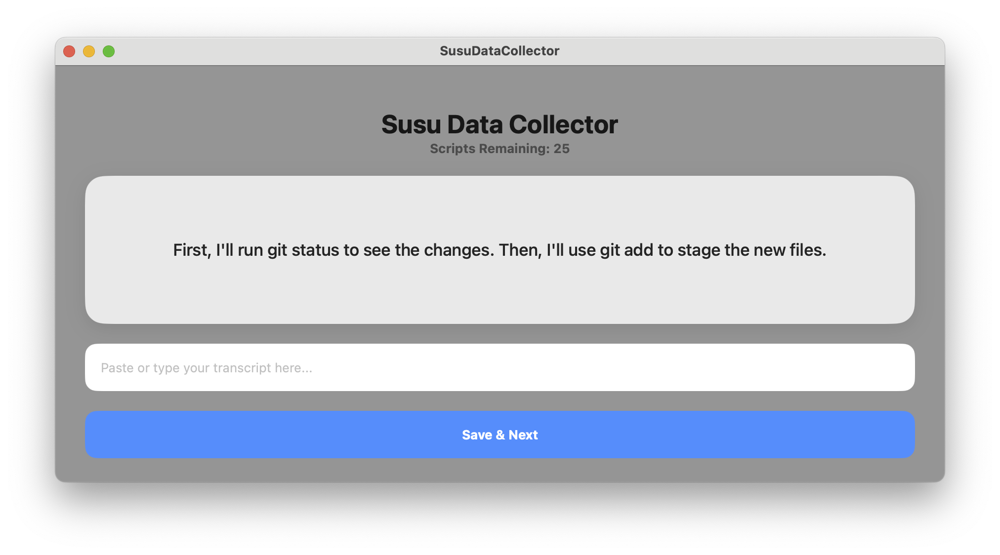

<p align="center">
  
</p>

# Susu Data Collector

Susu Data Collector is a macOS application for our collaborative project to build a high-quality transcription dataset for Susu, our voice transcription service. This tool enables contributors to easily generate and save transcripts for a standardized set of scripts.

## Contributor Workflow

1.  **Build the App**: Follow the "Building from Source" instructions below to run the application on your Mac.
2.  **Generate Transcript**: The app will display a script. Read the script aloud and use the Susu voice transcriber to generate the corresponding text. The transcript will be automatically pasted into the app's input field.
3.  **Save and Continue**: Either press the **Return** key or click the **Save & Next** button to save the transcript and proceed to the next script.
4.  **Submit Your Data**: After you complete the final script, the app will automatically open your default email client with a pre-filled email containing your `dataset.txt` file. Simply click "Send" to submit your contribution.

<p align="center">
  
</p>

## Building from Source

To build and run this project from the source code, follow these steps:

1.  **Clone the Repository**:
    ```bash
    git clone https://github.com/your-username/SusuDataCollector.git
    ```
2.  **Open the Project**: Open the `SusuDataCollector.xcodeproj` file in Xcode.
3.  **Build and Run**: Select the "SusuDataCollector" scheme and a macOS target, then click the "Run" button or press `Cmd+R`.
